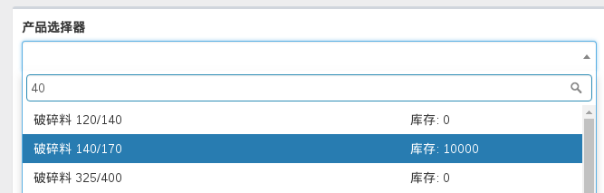

# Select2

http://demos.krajee.com/widget-details/select2

## 初阶

- array `data`: 适合使用 'yii\helpers\ArrayHelper::map()' 生成；
- string `theme`: 默认值：'krajee', 其它可选值：'default' (和 AdminLTE 更搭配一些), 'bootstrap' 和 'classic'
- array `options`: 
    - string `placeholder`: 提示符
    - boolean `multiple`: 是否支持多选，默认为 `false`；
- array `addon`: 添加 ajax 新建 option 的按钮
    - array | string `prepend`: 如果是数组，可以配置下面两个键：
        - string `content`: 一般为字体图标
        - boolean `asButton`: 默认值为 'false',
    - array | string `append`: 配置同 `prepend`;

一个最常见的配置实例：

```php
<?php
use kartik\widgets\Select2;
?>

<?= $form->field($model, 'customer_id')->widget(Select2::classname(), [
    'data' => User::mapCustomer(),
    'options' => ['placeholder' => '请选择'],
    'addon' => [
        'append' => [
            'content' => Html::button(Html::icon('plus'), [
                'class' => 'btn btn-default modal-create-customer', 
                'title' => '新建客户', 
                'data-toggle' => 'tooltip',
            ]),
            'asButton' => true
        ]
    ],
]) ?>
```

## 高阶

### 在 Modal 内动态显示 Select2

在 Modal 内使用 Select2 分两种情况：

- 借助 `yii\bootstrap\Modal` 在页面内直接显示；
- Modal 内容通过 AJAX 动态添加到 DOM 内，而后通过 JS 显示；

后一种情况必须使用 `renderAjax()` 才能正常显示，因为 Select widget 内涉及 registering assets.

#### Modal 内 Select2 无法搜索的问题

在 modal 内显示 Select2 有一个小问题——搜索功能失效。https://github.com/kartik-v/yii2-widget-select2/issues/41 提到 modal 的 `tabindex` 的值必须是 `false` 才可以。

```js
$('#customer-quick-cu-modal').modal({
    // ...
}).on('shown.bs.modal', function (e) {
    $(this).attr('tabindex', false)
})
```

### Ajax Loading Remote Data

对于内容较多的 Select2, 适合通过 AJAX 从远端获取数据。以下是核心配置的一个示例（EBP 中的产品选择器）：

```php
echo Select2::widget([
    'name' => 'sku_selecter',
    'options' => ['id' => 'sku-selecter', 'placeholder' => '选填。用于创建具有多种规格的商品'],
    'pluginOptions' => [
        'allowClear' => true,
        'minimumInputLength' => 2,
        'ajax' => [
            'url' => \yii\helpers\Url::to(['/demo/search']),
            'dataType' => 'json',
            'data' => new JsExpression('function(params) { return {keyword:params.term}; }')
        ],
        'language' => [
            'errorLoading' => new JsExpression("function () { return '查询中……'; }"),
            'noResults' => new JsExpression("function () { return '没有符合条件的记录'; }"),
            'inputTooShort' => new JsExpression("function () { return '输入关键字搜索（至少 2 个字符, 多个关键字用空格隔开）'; }"),
        ],
        'escapeMarkup' => new JsExpression('function (markup) { return markup; }'),
        'templateResult' => new JsExpression('function format(item) { return item.name; }'),
        'templateSelection' => new JsExpression('function format(item) { return item.name; }'),
    ],
]);
```

要点：

- `ajax` 选项：`url` 指定远端数据源地址; `data` 中，`params.term` 存储输入的字符；在上例中，将其值存储在 `keyword` 内发送到远端
- `templateResult`: 函数中的 `item` 就是从远端获取的数据集合中单个数据对象，通常对应一个 AR 模型，例如一个订单、一个产品等；

数据源控制器示例：

```php
public function actionSearch($q)
{
    Yii::$app->response->format = \yii\web\Response::FORMAT_JSON;

    return [
        'results' => Sku::find()->nameContains(explode(' ', $q))->asArray()->all(),
    ];
}
```

自定义模板信息

默认情况下， select2 option 内容仅仅显示文本内容。如果需要显示 HTML 内容（如图片等），就需要对数据稍作处理，例如:


```php
public function actionSearch($q)
{
    Yii::$app->response->format = \yii\web\Response::FORMAT_JSON;

    $data = [];
    
    $items = Sku::find()->nameContains(explode(' ', $q))->all();

    if (!empty($items)) {
        foreach ($items as $sku) {
            $data[] = [
                'id' => $sku->id,
                'name' => $sku->name,
                'template' => $sku->getSelect2Option(),
            ];
        }
    }

    return [
        'results' => $data,
    ];
}
```

在返回的对象中，除了 id 和 name 外，增加了 template 属性。内容如下：

```php
public function getSelect2Option()
{
    return <<<OPT
<div class="row">
    <div class="col-xs-8">{$this->name}</div>
    <div class="col-xs-4">库存: {$this->stock}</div>
</div>
OPT;
}
```

借助 Bootstrap, 在显示商品名称同时，同时显示当前库存数。配置好后，前面 Select2 `templateResult` 属性返回 'template' 即可。



#### Product Selecter

[Collect tabular input][ajax-tabular-input] 中通过一个“继续添加”的按钮动态新增一行 tabular 记录。还有一个场景是通过下拉菜单来搜索商品，选定后同样新增一行数据。两者的结果相同，不同的是触发方式，前者通过下拉菜单的 `select2:select` 事件触发，后者通过点击按钮触发。

配置 `ploginEvents` 属性，对 `select2:select` 事件指定一个 handler 响应:

```php
echo Select2::widget([
    // ...
    'pluginEvents' => [
        "select2:select" => "selectSku",
    ],
]);
```

Handler 内容大致如下：

```js
function selectSku(e) {
    var selector = $('#sku-selecter')
    var activeItem = e.params.data
    selector.select2('val', '')
    selector.select2('open');

    selector.trigger('selected.sku', activeItem)
}
```

Handler 说明：

- `e.params.data` 含有所选条目的对象;
- 自定义一个事件（如 `selected.sku`）携带选中的条目对象触发。根据需要编写对应的 handler (如 tabular input 中新增一行记录);

[ajax-tabular-input]: ../feature/collect-tabular-input.md
