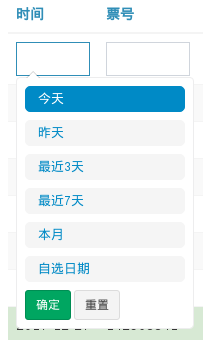
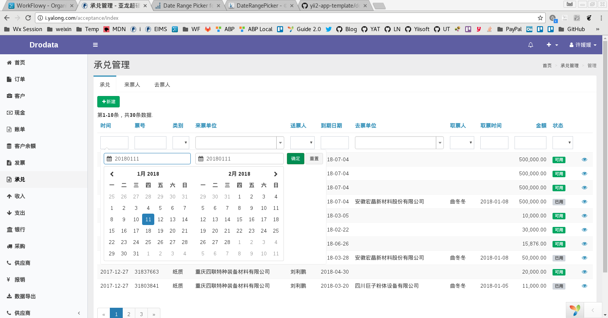

# Date Range Filter
对于使用时间戳类存储时间的模型来说，在 GridView 中过滤日期不太方便。

## 通过 DIC 全局配置 DateRangePicker

```php
Yii::$container->set('kartik\daterange\DateRangePicker', [
    'convertFormat'=>true,
    'pluginOptions'=> [
        'locale'=>[
            'format'=>'Ymd',
            'separator' => '-',
            'cancelLabel' => '重置',
        ],
    ],
    'pluginEvents'=> [
        "cancel.daterangepicker" => 'function(ev, picker) {$(this).val("").trigger("change");}',
    ],
]);
```
通过以上配置，使用 DateRangePicker widget 时，只需配置 model 和 atribute 两个属性即可。上面的配置指定日期范围的搜索格式为类似 `20120112-20120201` 的格式。

## Using DateRangePicker Filter in GridView

```php
use kartik\daterange\DateRangePicker;
use yii\grid\GridView;

echo GridView::widget([
    'searchModel' => $serachModel,
    'columns' => [
        [
            'attribute' => 'created_at',
            'format' => 'datetime',
            'contentOptions' => ['style' => 'width:180px'],
            'filter' => DateRangePicker::widget([
                'model' => $searchModel,
                'attribute' => 'created_at',
            ])
        ],
        // other columns configuration
    ],
]);
```

## Search Model Configuration

First of all, we need to change the rule of `created_at` attribute from `integer` to `safe`.

```php
public function rules()
{
    return [
        [['created_at'], 'safe'],
    ];
}
```

Second, we add a filter query which will convert human-readable string (e.g. 20120112-20120201) to real SQL clause:

```php
// in search model
if (!empty($this->created_at) && strpos($this->created_at, '-') !== false) {
    list($begin, $end) = explode('-', $this->created_at);
    $begin .= ' 00:00:00';
    $end .= ' 23:59:59';
    $query->andFilterWhere([
        'BETWEEN',
        static::tableName() . '.created_at',
        strtotime($begin),
        strtotime($end)
    ]);
}
```

## 个性化

### 增加预定义时间段

借助 `ranges` 属性，可以显示一些常用的时间段，且里面有一个“自选范围”的按钮。总体来看，这个比直接显示日历卡体验要好。

```php
'pluginOptions'=> ArrayHelper::merge($configs, [
    // ...
    'ranges' => [ 
        '今天' => ["moment()", "moment()"],
        '昨天' => ["moment().startOf('day').subtract(1,'days')", "moment().endOf('day').subtract(1,'days')"],
        '最近3天' => ["moment().subtract(2,'days')", "moment()"],
        '最近7天' => ["moment().subtract(6,'days')", "moment()"],
        '本月' => ["moment().startOf('month')", "moment().endOf('month')"],
    ],
]),
```



## Troubleshooting

### 筛选当天记录不工作

如果想筛选当天的记录，点击确定发现不起作用，且文本框内容仍是空字符。但是先选择一个时间段，再次选择当天时又工作了。



解决：显性在 `apply` event 内赋值并触发 change 事件：

```php
return DateRangePicker::widget([
    'model' => $model,
    'attribute' => $attribute,
    // ...
    'pluginEvents'=> [
        "apply.daterangepicker" => 'function(ev, picker) {
             $(this).val(picker.startDate.format("YYYYMMDD") + "-" + picker.endDate.format("YYYYMMDD")).trigger("change");
        }',
    ],
]);
```
