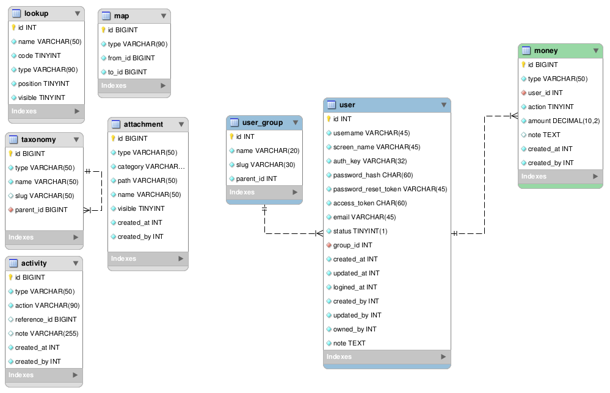

# 数据库表格结构



## `lookup`

此表用来存储字典，建立数据库中的值与显示给用户的值之间的映射。

Field | Type | Null | Key | Desc
------|------|------|-----|-----
id | INT | NO | PRI |
type | VARCHAR(90) | NO | |
name | VARCHAR(50) | NO | | 显示给用户的值
code | TINYINT | NO | | 实际存储的数值
path | VARCHAR(50) | NO | | hashed 相对路径
position | TINYINT | NO | | 供排序使用，默认与 code 值相同
visible | TINYINT | NO | |

## `map`

此表用来存储各种多对多映射。

Field | Type | Null | Key
------|------|------|----
id | BIGINT | NO | PRI
type | VARCHAR(90) | NO |
from_id | BIGINT | NO |
to_id | BIGINT | NO |

## `taxonomy`

'taxonomy', 意思是分类学, 用来存储各种较复杂的分类名称。'taxonomy' 一词借鉴自 WordPress 表格结构。

Field | Type | Null | Key
------|------|------|----
id | BIGINT | NO | PRI
type | VARCHAR(50) | NO |
name | VARCHAR(50) | NO |
slug | VARCHAR(50) | YES |
parent_id | BIGINT | NO | MUL
visible | TINYINT | NO | |

## `attachment`

此表用来存储各种模型的附件。

Field | Type | Null | Key | Desc
------|------|------|-----|-----
id | BIGINT | NO | PRI |
type | VARCHAR(50) | NO | |
category | VARCHAR(50) | NO | |
path | VARCHAR(50) | NO | | hashed 相对路径
name | VARCHAR(50) | YES | | 原始文件名
visible | TINYINT | NO | |
created_at | INT | NO | |
created_by | INT | NO | |

## `activity`

此表用来存储各种模型的活动记录。

Field | Type | Null | Key
------|------|------|----
id | BIGINT | NO | PRI
type | VARCHAR(50) | NO |
action | VARCHAR(90) | NO |
reference_id | BIGINT | YES |
note | VARCHAR(255) | YES |
created_at | INT | NO |
created_by | INT | NO |

假设有一个订单模型，当库房将单号为 1001 的订单进行发货操作时，可以向 activity 表写入如下一条记录：

```
'order', 'dispatch', 1001, null, <timestamp>, 5 
```

用此数据经过拼装，可以生成诸如“某年某月某日 库房将订单 1001 发货，运单号 xxx" 的活动记录。

## `money`

此表用来存储各种涉及金额变动的记录。例如客户的账户余额/预付款、供应商的应付金额、员工的预支现金等。

Field | Type | Null | Key
------|------|------|----
id | BIGINT | NO | PRI
type | VARCHAR(50) | NO |
user_id | INT | NO | MUL
action | TINYINT | NO |
amount | DECIMAL(10,2) | NO |
note | TEXT | YES |
created_at | INT | NO |
created_by | INT | NO |

说明：

- user_id 设置为 user 表的外键。要求类似客户、供应商等表格与用户表共用同一个主键。换句话说，user 表仅存储基本信息，其它模型特有的属性单独建表（例如客户的账户余额、供应商的应付账款等）
- type 列没有设计成 lookup code. 此列对用户不可见，不涉及字典查找的情况，直接存储成字符串更简单；
